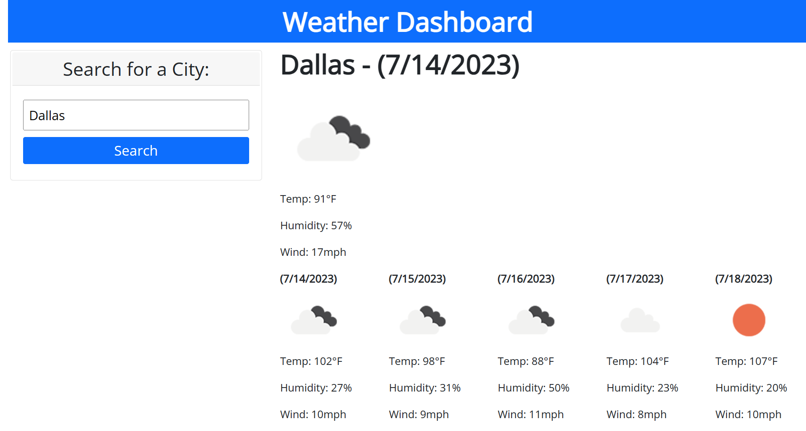

# Server-Side APIs: Weather Dashboard

## Table of Contents

- [Description](#description)
- [Code Languages](#code-languages)
- [Installation](#installation)
- [Usage](#usage)

## Description

The purpose of this project is to build a weather dashboard that uses third-party server-side APIs to display today's weather forecast as well as the weather forecast for the next 5 days for each searched city. The application runs in the browser and features dynamically updated HTML and CSS.

## Code Languages

- HTML
- CSS
- JavaScript/ jQuery

## Installation

- Not required.
- You can view the screenshot or live website in the Usage section, below.

## Usage

To use the application,
- Visit the website at (https://skhai77.github.io/weather-dashboard)
- You will see a weather dashboard with form inputs and search button where you can type and search for a city's weather forecast 
- When you search for a city
- You will be presented with current and future conditions for that city and that city will be added to the search history
- When you view current weather conditions for that city
- You will be presented with the city name, the date, an icon representation of weather conditions, the temperature, the humidity, and the wind speed
- When you view future weather conditions for that city
- You will be presented with a 5-day forecast that displays the date, an icon representation of weather conditions, the temperature, the wind speed, and the humidity
- If you click on a city in the search history
- You will again be presented with current and future conditions for that city

Preview the homepage:

